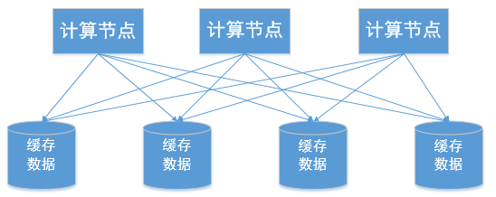
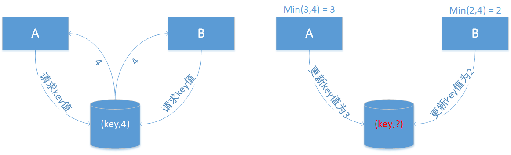

# 分布式缓存的并发更新问题

## 问题描述

​        缓存服务器常用来提高数据访问的效率。诸如Hazelcast、Redis、MemoryCache等产品，都提供了分布式的缓存池来存放用户需要的高频数据。它们提供了常用了诸如List、Map、Set的数据结构来存储数据，只是这些数据不再分配在单机节点上，而是分布式的存储在多个缓存节点上，因此我们称这样的数据结构为Distributed List、Distributed Map和Distributed Set。



​    我们以Distributed Map为例，如上图所示，设有3个计算节点和4个缓存节点，计算节点访问缓存节点中的数据。如果计算节点对数据的修改方式如下：

```java
//step1: get the old state.
State oldState = map.get(key);
//step2: use the old state and the incoming event to calculate the new state.
State newState = calculate(oldState,event)
//step3: update the state.
map.put(key,newState);
```

当**对缓存服务器中的数据的更新，是基于历史状态的**，则会出现**读取脏数据**的情况。

​        如当计算节点1在读取某个key的数据并完成新状态的计算之后，在即将准备更新时，计算节点2读取了这个key的状态。因为计算节点1还没有来得及更新计算节点2的状态，所以计算节点2读取了原始的脏的数据，可能导致最终计算结果不准确。

​        实例如下：如下图所示，假设存在计算节点A和B需要访问和修改相同的key，计算逻辑为求原始状态和最新到达事件的最小值，即calculate()为min(oldState,event)，而节点A的event为3，节点B的event为2。key原始的状态为4。在左图中，A和B分别获取key当前的状态为4；在右图中，A节点通过min函数求得当前的最小值为3，准备将该值写入到缓存中，同时B节点也通过min函数求得当前的最小值为2,也准备写入到缓存中，如果A先写入缓存B后写入缓存，则key的最终状态为2，结果正确，但如果B先写入缓存A后写入，则key的最终状态为3，结果错误。而AB节点谁先写谁后写无法保证，所以就无法保证程序最终结果的正确性。



## 尝试解决方法

CAS(compare and swap)

将上述的代码改成如下形式：

```java
for(;;){
  //step1: get the old state.
  State oldState = map.get(key);
  //step2: use the old state and the incoming event to calculate the new state.
  State newState = calculate(oldState,event)
  //step3: update the state.
  if(replace(key,oldState,newState))
    break;
}
```

